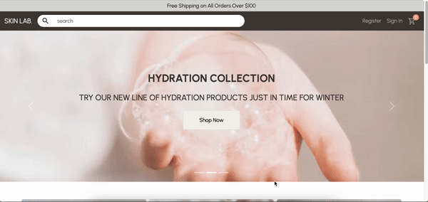

# Skin Lab E-Commerce App

Skinlab is a skincare e-commerce app that allows users to browse and purchase skincare products via checkout using stripe. This full stack app was created with ReactJS for client side and Flask Python and MySQL for server side.

## Final Product

### Overview

### Add to / Delete from Cart

### Add to / Delete from Wishlist

### Search for Product

### Login / Logout

### Register

## Setup

- Create account with [Stripe](https://dashboard.stripe.com/register/), and retrieve API keys under Developers tab
- Set up .env file using .env.example file for stripe public API key in client directory
- Set up .env file using .env.example file for stripe secret API key, secret key and mySQL config in server_backend directory
- Open up 2 terminals
- Navigate to root of each directory and install dependencies with `npm install` for client and `pip install -r requirements.txt` for server_backend
- Run `npm start` to start client side at localhost:3000 and `python3 main.py` to start server side at locahost:5000

## Project Stack

- Front-End: React, Axios, SASS, Bootstrap
- Back-End: Flask, Python, MySQL, SQLAlchemy

## Dependencies

- react
- axios
- bootstrap
- node sass
- react router dom
- material UI
- flask
- mySQL
- SQLAlchemy
- dotenv
- werkzeug
- stripe

## Connect With Me

[Github](https://github.com/gloria-cheung)
-- [Linkedin](http://www.linkedin.com/in/gloria-cheung) --
[Portfolio](http://www.gloria-cheung.com)
